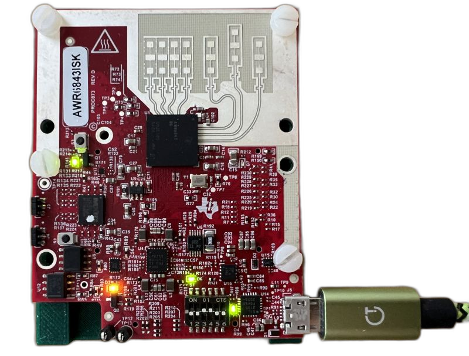
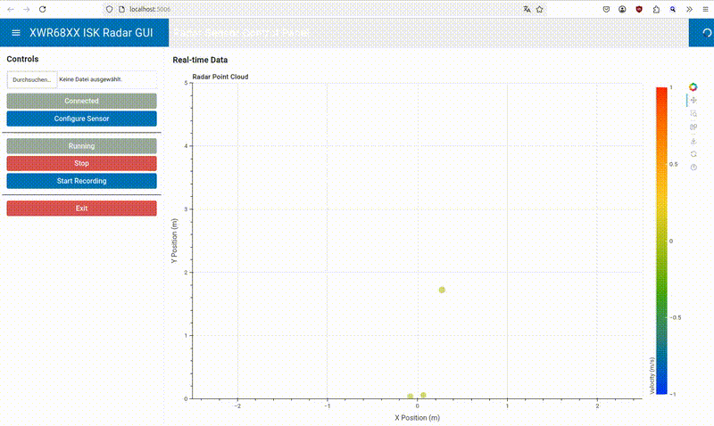

# Software for the xwr68xxisk radar sensor evaluation kit



Allows for recording radar data to a CSV file and displaying the data in a GUI.

**Note**: This is a work-in-progress. Especially the part parsing the radar profiles is only marginally functional.

Works with the mmw demo application from TI by default:

    Platform                : xWR68xx
    mmWave SDK Version      : 03.06.02.00
    Device Info             : AWR68XX ASIL-B non-secure ES 02.00
    RF F/W Version          : 06.03.02.06.20.08.11
    RF F/W Patch            : 00.00.00.00.00.00.00
    mmWaveLink Version      : 01.02.06.06

Make sure, the dip switches on the board are set to OFF-OFF-ON-ON-OFF-OFF.

## Installation

```bash
pip install .
```

## Usage

```bash
xwr68xxisk --help

usage: xwr68xxisk [-h] [--log-level {DEBUG,INFO,WARNING,ERROR,CRITICAL}] [--serial-number SERIAL_NUMBER] [--transport {auto,serial,network}] [--bridge-control BRIDGE_CONTROL] [--bridge-data BRIDGE_DATA] {gui,record} ...

XWR68XX ISK Radar Tools

positional arguments:
  {gui,record}          Available commands
    gui                 Start the radar GUI
    record              Record radar data to CSV file

options:
  -h, --help            show this help message and exit
  --log-level {DEBUG,INFO,WARNING,ERROR,CRITICAL}
                        Set the logging level (default: INFO)
  --serial-number SERIAL_NUMBER
                        Radar serial number in hex format "1234ABCD"
  --transport {auto,serial,network}
                        Select connection transport (auto=prefer serial, fallback to network bridge)
  --bridge-control BRIDGE_CONTROL
                        Radar bridge ZeroMQ control endpoint (network transport)
  --bridge-data BRIDGE_DATA
                        Radar bridge ZeroMQ data endpoint (network transport)

```

The serial number is unique and read from the USB interface of the sensor.
Use the network transport when the radar is attached to a different PC via the
radar bridge service. The default endpoints (`tcp://127.0.0.1:5557` control,
`tcp://127.0.0.1:5556` data) match `radarbridge_client.py`.

### Configuration

The default radar profile is stored in `configs/user_profile.cfg`. 
The package configuration can be found in `configs/default_config.yaml`

### Commandline recording

```bash

$ xwr68xxisk record --help
usage: xwr68xxisk record [-h] [--profile PROFILE]

options:
  -h, --help         show this help message and exit
  --profile PROFILE  Path to the radar profile configuration file


$ xwr68xxisk record
2025-02-20 09:49:47 - INFO - Found CLI port: /dev/ttyUSB0
2025-02-20 09:49:47 - INFO - Found Data port: /dev/ttyUSB1
2025-02-20 09:49:47 - INFO - Serial number: 00F48B0C
2025-02-20 09:49:50 - INFO - Radar configured and started
Recording data to recordings/radar_data_20250220_094947.csv
Press Ctrl+C to stop recording
Frame: 12, Points: 15    ^C

```

To operate via the network bridge instead of a local serial connection:

```bash
$ xwr68xxisk --transport network --bridge-control tcp://radarhost:5557 --bridge-data tcp://radarhost:5556 gui
```

The helper script `radarbridge_client.py` shows the raw ZeroMQ interaction if
you need to debug the bridge endpoints.

### GUI usage

The GUI is used to display the radar point cloud in realtime (100ms update rate).
Just click "Connect" and then "Start" to start the radar.

```bash
$ xwr68xxisk gui
```




To run the GUI against the bridge, provide the same transport parameters:

```bash
$ xwr68xxisk gui --transport network --bridge-control tcp://radarhost:5557 --bridge-data tcp://radarhost:5556
```


Remote operation is possible like this:
```bash
BOKEH_ALLOW_WS_ORIGIN=radarhost:5006 xwr68xxisk gui --remote
```
