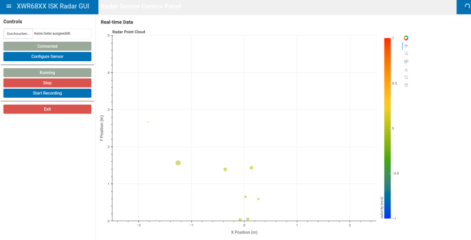

# Software for the xwr68xxisk radar sensor evaluation kit

Allows for recording radar data to a CSV file and displaying the data in a GUI.

Works with the mmw demo application from TI by default:

    Platform                : xWR68xx
    mmWave SDK Version      : 03.06.02.00
    Device Info             : AWR68XX ASIL-B non-secure ES 02.00
    RF F/W Version          : 06.03.02.06.20.08.11
    RF F/W Patch            : 00.00.00.00.00.00.00
    mmWaveLink Version      : 01.02.06.06


## Installation

```bash
pip install .
```

## Usage

```bash
xwr68xxisk --help

usage: xwr68xxisk [-h] [--log-level {DEBUG,INFO,WARNING,ERROR,CRITICAL}] [--serial-number SERIAL_NUMBER] {gui,record} ...

XWR68XX ISK Radar Tools

positional arguments:
  {gui,record}          Available commands
    gui                 Start the radar GUI
    record              Record radar data to CSV file

options:
  -h, --help            show this help message and exit
  --log-level {DEBUG,INFO,WARNING,ERROR,CRITICAL}
                        Set the logging level (default: INFO)
  --serial-number SERIAL_NUMBER
                        Radar serial number in hex format "1234ABCD"
```

The serial number is unique and read from the USB interface of the sensor.

### Commandline usage

```bash
$ xwr68xxisk record
2025-02-20 09:49:47 - INFO - Found CLI port: /dev/ttyUSB0
2025-02-20 09:49:47 - INFO - Found Data port: /dev/ttyUSB1
2025-02-20 09:49:47 - INFO - Serial number: 00F48B0C
2025-02-20 09:49:50 - INFO - Radar configured and started
Recording data to recordings/radar_data_20250220_094947.csv
Press Ctrl+C to stop recording
Frame: 12, Points: 15    ^C

```

### GUI usage

```bash
$ xwr68xxisk gui
```




