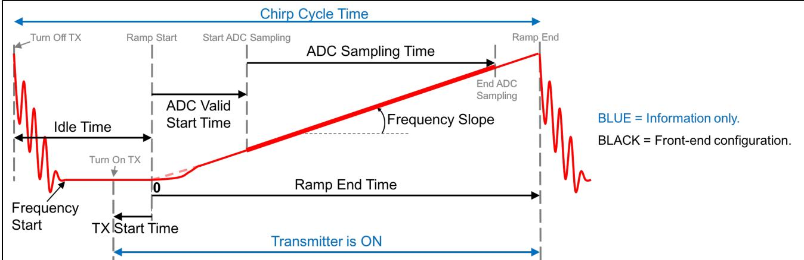

# Configuration (.cfg) File Format

Each line in the .cfg file describes a command with parameters. The various commands and their arguments are described in the table below (arguments are in sequence).

## List of commands

Taken from "mmwave_sdk_<ver>\packages\ti\control\mmwavelink\docs\doxygen\html\index.html". Additionally, users can refer to the chirp diagram below to understand the chirp and profile related parameters or the appnote <http://www.ti.com/litv/pdf/swra553>

Figure 2: Chirp Diagram

| Configuration Command | Command Details | Command Parameters | Usage in mmW demo |
|---------------------|-----------------|-------------------|------------------|
| dfeDataOutputMode | The values in this command should not change between sensorStop and sensorStart. Reboot the board to try config with different set of values in this command. This is a mandatory command. | **modetype**: • 1 - frame based chirps • 2 - continuous chirping • 3 - advanced frame config | Only option 1 and 3 are supported |
| channelCfg | Channel config message to RadarSS. See mmwavelink doxgen for details. The values in this command should not change between sensorStop and sensorStart. This is a mandatory command. | **rxchannelen**: • Receive antenna mask e.g for 4 antennas, it is 0x1111b = 15  **txchannelen**: • Transmit antenna mask  **cascading**: • SoC cascading, not applicable, set to 0 | • 4 antennas supported • For antenna configuration: &nbsp;&nbsp;- IWR6843 ISK: Use 0x5 for 2 azimuth antennas (tx1, tx3), 0x7 for both azimuth and elevation (tx1, tx2, tx3) &nbsp;&nbsp;- xWR1642BOOST: Use 0x3 for 2 azimuth antennas (tx1, tx2) • Cascading: n/a |
| adcCfg | ADC config message to RadarSS. See mmwavelink doxgen for details. The values in this command should not change between sensorStop and sensorStart. This is a mandatory command. | **numadcbits**: • 0 - 12-bits • 1 - 14-bits • 2 - 16-bits  **adcoutputfmt**: • 0 - real • 1 - complex 1x (filtered) • 2 - complex 2x (unfiltered) | • Only 16-bit is supported • Only complex modes are supported |
| adcbufCfg | adcBuf hardware config. The values in this command can be changed between sensorStop and sensorStart. This is a mandatory command. | **subframeidx**: • subframe Index  **adcoutputfmt**: • 0 - Complex • 1 - Real  **sampleswap**: • 0 - I in LSB, Q in MSB • 1 - Q in LSB, I in MSB  **chaninterleave**: • 0 - interleaved (XWR14xx only) • 1 - non-interleaved  **chirpthreshold**: • Threshold for buffer switch (0-8) | • Legacy mode: subframeidx = -1 • Advanced frame: use subframe number or -1 • Only complex modes supported • Only option 1 for sampleswap • Only option 1 for chaninterleave • xwr16xx: 0-8 supported (1 for LVDS) • Other platforms: only value 1 |
| profileCfg | Profile config message to RadarSS and datapath. See mmwavelink doxgen for details. The values in this command can be changed between sensorStop and sensorStart. This is a mandatory command. | **profileid**: • Profile Identifier  **startfreq**: • Frequency Start in GHz  **idletime**: • Idle Time in μs  **adcstarttime**: • ADC Valid Start Time in μs  **rampendtime**: • Ramp End Time in μs  **txoutpower**: • TX power back-off code  **txphaseshifter**: • TX phase shifter  **freqslopeconst**: • Freq slope (MHz/μs)  **txstarttime**: • TX Start Time (μs)  **numadcsamples**: • ADC sample count  **digoutsamplerate**: • ADC freq (ksps)  **hpfcornerfreq1/2**: • HPF settings  **rxgain**: • RX gain (dB) | • Legacy: One profile per config • Advanced: One profile per subframe • All timing per datasheet • txoutpower=0, txphaseshifter=0 • freqslopeconst > 0 • HPF1: 175/235/350/700 KHz • HPF2: 350/700/1400/2800 KHz |
| calibDcRangeSig | DC range calibration configuration | **subFrameIdx**: • Subframe index  **enabled**: • Enable/disable calibration  **negativeBinIdx**: • Negative bin index  **positiveBinIdx**: • Positive bin index  **numAvgFrames**: • Number of frames to average | Example: `calibDcRangeSig -1 0 -5 8 16` |
| clutterRemoval | Clutter removal configuration | **subFrameIdx**: • Subframe index  **enabled**: • Enable/disable clutter removal | Example: `clutterRemoval -1 0` |
| compRangeBiasAndRxChanPhase | Range bias and RX channel phase compensation | **rangeBias**: • Range bias value  **Re/Im[XX]**: • Real and imaginary components for each channel | Complex calibration parameters for RX channels |
| aoaFovCfg | Angle of Arrival Field of View configuration | **subFrameIdx**: • Subframe index  **minAzimuthDeg**: • Minimum azimuth in degrees  **maxAzimuthDeg**: • Maximum azimuth in degrees  **minElevationDeg**: • Minimum elevation in degrees  **maxElevationDeg**: • Maximum elevation in degrees | Sets the field of view limits for angle of arrival processing |
| cfarCfg | CFAR detection configuration | **subFrameIdx**: • Subframe index  **procDirection**: • 0: range, 1: doppler  **averageMode**: • Averaging mode  **winLen**: • Window length  **guardLen**: • Guard length  **noiseDiv**: • Noise divider  **cyclicMode**: • Cyclic mode  **thresholdScale**: • Threshold scale  **peakGroupingEn**: • Peak grouping enable | Example: `cfarCfg -1 0 2 8 4 3 0 15 1` |
| multiObjBeamForming | Multi-object beamforming configuration | **subFrameIdx**: • Subframe index  **enabled**: • Enable/disable  **threshold**: • Detection threshold | Example: `multiObjBeamForming -1 1 0.5` |
| guiMonitor | GUI monitoring configuration | **detectedObjects**: • 0: None • 1: Objects + side info • 2: Objects only  **logMagRange**: • Log magnitude range  **noiseProfile**: • Noise floor profile  **rangeAzimuthHeatMap**: • Range-azimuth heat map  **rangeDopplerHeatMap**: • Range-Doppler heat map  **statsInfo**: • Statistics information | Example: `guiMonitor -1 1 1 0 0 0 1` |
| analogMonitor | Analog monitoring configuration | **rxSaturation**: • RX saturation monitoring  **sigImgBand**: • Signal image band monitoring | Example: `analogMonitor 0 0` |
| lvdsStreamCfg | LVDS streaming configuration | **subFrameIdx**: • Subframe index  **enableHeader**: • Enable header  **dataFmt**: • Data format  **enableSW**: • Enable software | Controls LVDS data streaming |

